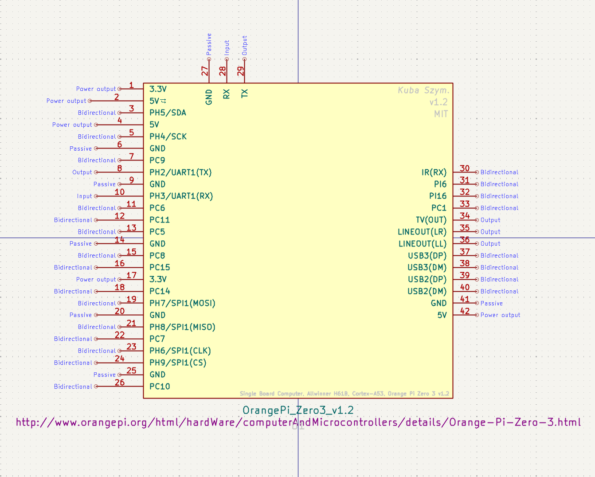

# Orange Pi Zero 3 (v1.2) - KiCad Symbol

Accurate and visualization-ready KiCad symbol for the **Orange Pi Zero 3 (Revision v1.2)**.

## Why this library?

I created this symbol because I couldn't find an accurate schematic for the v1.2 revision online. Most available libraries were either outdated, generic, or did not reflect the actual physical pinout of the expansion header.

This library is designed to save you time digging through datasheets.

## Key Features

- **Verified Pinout:** Matches the physical **v1.2** board layout.
- **Correct Function Mapping:**
  - **UART Mapping:** UART pins are labeled based on the popular **Armbian** configuration [UART1 (/dev/ttyS1) on PH2/PH3], reflecting the most common real-world usage.
- **Visualization Ready:** Ideal for creating professional-looking schematics for engineering theses and documentation.

## Preview

## Compatibility

- **Hardware:** Orange Pi Zero 3 (Allwinner H618) - v1.2
- **Software Context:** Pin labels correlate with standard Armbian device tree overlays.

## Installation

1.  Download the `.kicad_sym` file.
2.  Open KiCad Schematic Editor.
3.  Go to `Preferences` -> `Manage Symbol Libraries`.
4.  Add the downloaded file as a "Project Specific" library.

## License

MIT License. Free to use for academic and commercial projects.
